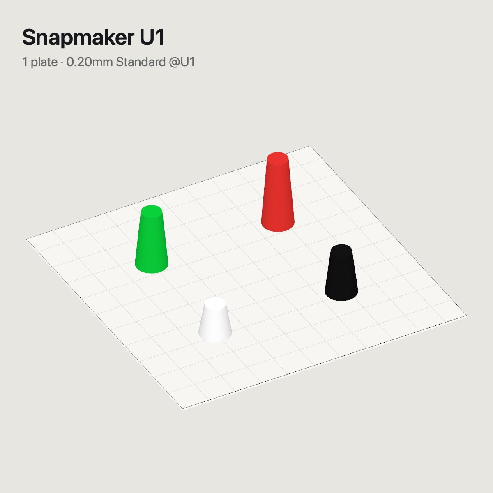

<div align="center">

# 3dSlicerRouter

**Double-click any `.3mf` on your Mac and it opens in the right slicer: Bambu Studio for Bambu Lab
printers, Snapmaker Orca for Snapmaker.** No more "this project was made for another printer" warnings.

[](https://github.com/MoraesGil/3dSlicerRouter/actions/workflows/ci.yml)


[](LICENSE)

[Install](docs/INSTALL.md) · [Samples](samples/) · [How it works](#how-it-decides) · [Português](README.pt-BR.md)

 

</div>

---

## Why

If you own printers from more than one brand, every `.3mf` looks the same in Finder, but only one
slicer really understands each file. Open a Snapmaker U1 project in Bambu Studio (or the other way round)
and you get preset warnings, missing filaments or a silently swapped bed type.

**3dSlicerRouter** becomes the default app for `.3mf`. It does not open the file itself: it reads which
printer the project was made for and hands the file to the slicer that owns that printer. It takes a
fraction of a second and has no window of its own.

## Features

- **Routes by printer, not by file name.** It reads `printer_model` from the project
  (`Bambu Lab A1`, `Bambu Lab H2D`, `Snapmaker U1`, …), so it works with any printer of either brand.
- **Remembers per file.** The decision is stored in an extended attribute on the file itself
  (`com.moraesdev.slicer-router`, a UUID plus the decision) and mirrored in a local SQLite index.
  Copy the file anywhere on APFS and the memory travels with it.
- **Notices when you retarget a project.** Change the printer inside the file and the next double-click
  follows it (see the [rules](#how-it-decides)).
- **Any printer, any slicer.** A printer it has never seen asks once. Pick Bambu Studio, Snapmaker Orca
  or *Other app…* (native picker in `/Applications`) and tick *Always use for this printer*.
- **Hold ⌥ (Option) while opening** to choose the slicer for this file, e.g. to open a U1 project in
  Bambu Studio and retarget it to an A1. Finder's *Open With* keeps working as usual.
- **Finder knows where each file goes:**
  - **List view and small icons** show the icon of the slicer the file will open in.
  - **Medium/large icons, Gallery and the preview pane** show the plate preview: the image the slicer
    saved in the project or, when there is none, a rendered isometric view of the declared printer's
    bed with every plate.
  - **Quick Look (Space)** on a single-plate project is a live 3D view you can orbit and zoom.
    Multi-plate projects show the panoramic render.
- **Optional AI fallback.** Files with no printer at all can be classified by a local typed-judgment
  service ([LAYA](#optional-laya-classifier)). It only opens directly with ≥ 75 % confidence;
  otherwise it asks, with its guess first.
- **Zero dependencies, fully native.** Zip, SQLite, SceneKit, Quick Look and LaunchServices all come
  from macOS. The only network call is the optional classifier on `localhost`.

## How it decides

| Situation | What happens |
|---|---|
| First open, printer is `Bambu Lab …` | Opens in **Bambu Studio** |
| First open, printer is `Snapmaker …` | Opens in **Snapmaker Orca** |
| First open, printer it does not know (e.g. `Original Prusa MK4S`) | Asks once; *Always use for this printer* saves the mapping |
| Same file, same printer | Opens where it opened last time, including manual choices |
| Printer changed within the same brand (A1 → A1 mini) | Same slicer, no question |
| Printer changed **to Bambu Lab** (e.g. U1 → A1) | Bambu Studio, no question |
| Printer changed to **another brand** (e.g. A1 → U1) | Asks, with the mapped slicer suggested |
| No printer declared | Optional classifier; if unsure, asks |
| You held **⌥** while opening | Always asks |

> The `Application` metadata is **not** used: Snapmaker Orca writes `BambuStudio-…` there too.
> The printer comes from `Metadata/project_settings.config` → `printer_model`.

## Install

Requirements: macOS 14 Sonoma or newer, plus Bambu Studio and/or Snapmaker Orca.

```sh
brew install xcodegen                         # build tool (only to compile)
git clone https://github.com/MoraesGil/3dSlicerRouter.git
cd 3dSlicerRouter
./scripts/build.sh --install                  # builds and copies to /Applications
/Applications/3dSlicerRouter.app/Contents/MacOS/3dSlicerRouter --set-default
```

Full guide, prebuilt download, dependencies and **uninstall**: [docs/INSTALL.md](docs/INSTALL.md).

## Try it with the samples

The [`samples/`](samples/) folder has six tiny synthetic projects, one per routing path:

```sh
open samples/bambu-a1-keychain-tray.3mf          # → Bambu Studio
open samples/snapmaker-u1-four-colors.3mf        # → Snapmaker Orca
open samples/unknown-printer-prusa-mk4s.3mf      # → asks once
```

Or check the decision without opening anything:

```sh
/Applications/3dSlicerRouter.app/Contents/MacOS/3dSlicerRouter --inspect samples/*.3mf
```

## Command line

```
3dSlicerRouter --inspect file.3mf…            printer, thumbnail, memory, decision (writes nothing)
3dSlicerRouter --render file.3mf out.png [px] isometric plate preview as PNG
3dSlicerRouter --forget file.3mf…             erase the router's memory for these files
3dSlicerRouter --set-default                  make the router the default app for .3mf
3dSlicerRouter --version
```

## Optional: LAYA classifier

Only used for files that declare **no** printer. The router sends one `choice` question with the file
name, creator application, presets and object names to a local endpoint and expects:

```json
{ "answers": { "slicer": { "choice": "bambu_studio", "probabilities": { "bambu_studio": 0.91 } } } }
```

Default endpoint `http://127.0.0.1:8100/v1/systemone`. If nothing is listening the router just asks
you, with no delay. Change it or turn it off:

```sh
defaults write com.moraesdev.3dslicerrouter LayaEndpoint http://127.0.0.1:9000/v1/systemone
defaults write com.moraesdev.3dslicerrouter LayaEndpoint off
```

## Project layout

```
Sources/Core        3MF reader (zip + metadata), routing rules, SceneKit plate renderer   (shared)
Sources/App         router app: open handler, dialogs, SQLite/xattr memory, CLI
Sources/Thumbnail   Quick Look thumbnail extension (slicer icon / plate preview)
Sources/Preview     Quick Look preview extension (interactive 3D)
Tests               routing rules, plate layout, 3MF parsing against samples/
samples             synthetic 3MF projects + generator (scripts/make_samples.py)
```

## Roadmap

- [ ] More slicers out of the box (OrcaSlicer, PrusaSlicer, Elegoo, Creality Print)
- [ ] Small settings window for printer → slicer mappings
- [ ] Painted (multi-material) faces in the preview
- [ ] Notarized release build

Ideas and PRs are welcome: see [CONTRIBUTING.md](CONTRIBUTING.md).

## Disclaimer

Not affiliated with, endorsed by or sponsored by Bambu Lab or Snapmaker. Product names are
trademarks of their respective owners and are used only to describe compatibility.

## License

[MIT](LICENSE) © Gilberto Moraes ([@MoraesGil](https://github.com/MoraesGil))
