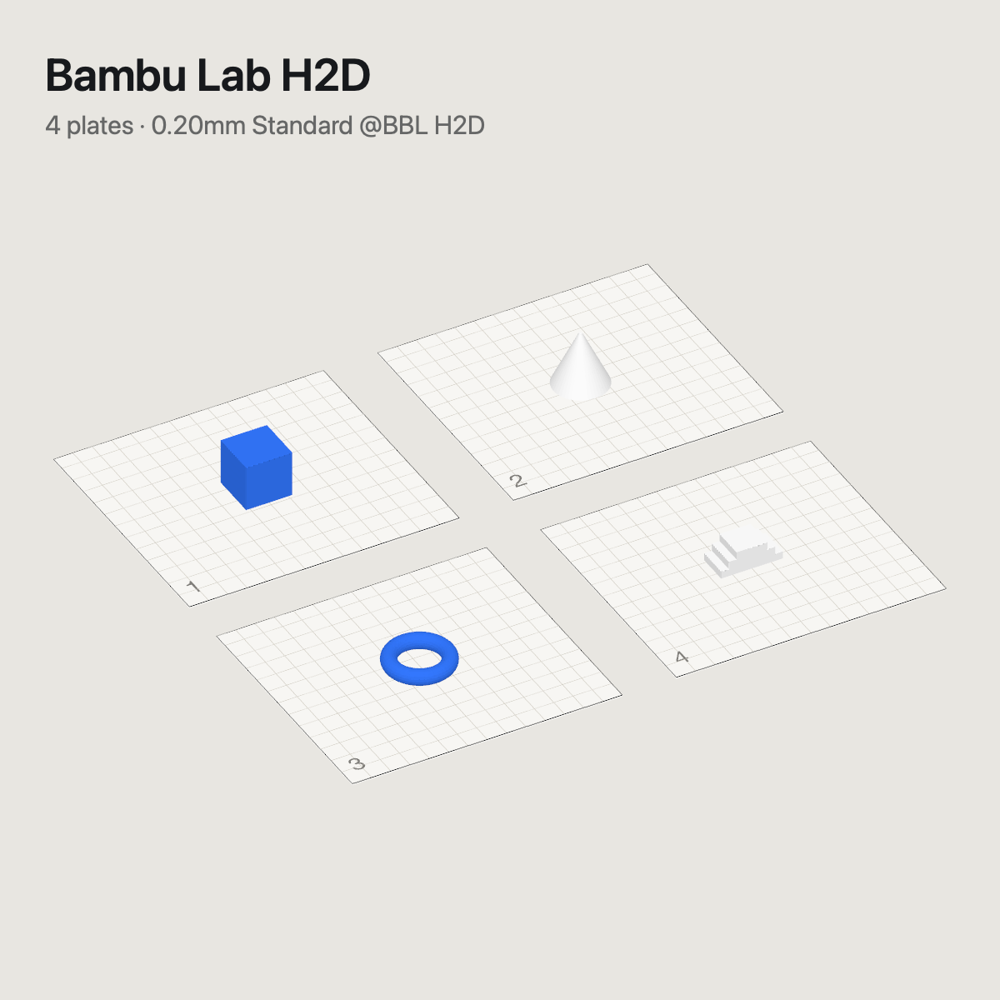

<div align="center">

# 3dSlicerRouter

### Open every `.3mf` in the right slicer, automatically.

Double-click a 3MF on your Mac. 3dSlicerRouter reads the printer saved inside the file and opens
**Bambu Studio**, **Snapmaker Orca** or any slicer you choose.

[](https://github.com/MoraesGil/3dSlicerRouter/actions/workflows/ci.yml)


[](LICENSE)



[Install](docs/INSTALL.md) · [Try the samples](samples/) · [How it decides](#how-it-decides) · [Português](README.pt-BR.md)

</div>

## The problem

Bambu Studio, Snapmaker Orca, OrcaSlicer and PrusaSlicer all save `.3mf`, and Finder can only
have one default app for it. With printers from two brands you end up opening a U1 project in
Bambu Studio (or an A1 project in Orca) and getting preset warnings, missing filaments or a bed type
that changed without you noticing.

3dSlicerRouter becomes the default app for `.3mf` and gets out of the way. It has no window: it
reads `printer_model` from the project and hands the file to the slicer that owns that printer.

## Any printer, any slicer

| | Printer in the file | Opens in |
|:-:|---|---|
|  | `Bambu Lab A1`, `A1 mini`, `P1S`, `X1C`, `H2D`, … | **Bambu Studio** |
|  | `Snapmaker U1`, `J1`, `Artisan`, … | **Snapmaker Orca** |
| | Anything else (`Original Prusa MK4S`, `Elegoo Centauri Carbon`, …) | **Your choice**, asked once and remembered |

For a printer it has never seen, the router asks once: Bambu Studio, Snapmaker Orca or
**Other app…**, a native picker where any slicer in `/Applications` works (OrcaSlicer, PrusaSlicer,
Creality Print, Elegoo Slicer, Cura). Tick *Always use for this printer* and you are never asked again.
You can also map printers from the terminal:

```sh
3dSlicerRouter --map "Original Prusa MK4S" /Applications/PrusaSlicer.app
3dSlicerRouter --mappings
```

Need the other slicer for one file? **Hold ⌥ (Option) while opening** and pick. Finder's
*Open With* keeps working too, and the next double-click reads the file again.

## Already open? No second window

Bambu Studio and Snapmaker Orca start a **new instance** when you open a project that is already
open, so you end up editing the same file in two windows. 3dSlicerRouter checks first. When the file
is the open project of a running slicer, it tells you so, says whether it has unsaved changes, and
offers:

- **Switch to the slicer**: brings that exact window forward.
- **Reload from disk**: closes that project the normal way (the slicer asks before discarding
  unsaved changes) and reopens the saved file.
- **Open another copy**: the old behaviour, if you really want it.

It reads the recovery folders the slicers keep in `$TMPDIR` while a project is open, so it needs no
extra permissions. `3dSlicerRouter --inspect file.3mf` shows the same information.

## See where a file goes before you open it

The router also teaches Finder about 3MF projects:

- **List view and small icons** show the icon of the slicer the file will open in.
- **Larger icons, Gallery and the preview pane** show the plate: the image the slicer saved, or a
  rendered isometric view of the declared printer's bed when the file has none.
- **Quick Look (Space)** on a single-plate project is a 3D view you can orbit and zoom. Projects with
  several plates show every plate side by side.

<p align="center">


</p>

## How it decides

| Situation | Result |
|---|---|
| First open | Slicer mapped to the file's printer; unknown printer asks once |
| Same file, same printer | Where it opened last time, manual choices included |
| Printer changed within the brand (A1 → A1 mini) | Same slicer, no question |
| Printer changed to Bambu Lab (U1 → A1) | Bambu Studio, no question |
| Printer changed to another brand (A1 → U1) | Asks, with the mapped slicer first |
| No printer in the file | Optional local classifier, otherwise asks |
| ⌥ held while opening | Always asks |
| File already open in a slicer | Switch to it, reload from disk or open another copy |

The decision is stored in a local SQLite index and on the file as an extended attribute
(`com.moraesdev.slicer-router`). Slicers replace the file when they save, which drops the attribute;
the router then finds the decision by path and stamps it again. **The file's contents are never
modified by the router.**

> Why not the `Application` field? Snapmaker Orca also writes `BambuStudio-…` there. The printer comes
> from `Metadata/project_settings.config` → `printer_model`.

## Install

Requires macOS 14 or newer and at least one slicer.

```sh
brew install xcodegen
git clone https://github.com/MoraesGil/3dSlicerRouter.git && cd 3dSlicerRouter
./scripts/build.sh --install
alias 3dSlicerRouter=/Applications/3dSlicerRouter.app/Contents/MacOS/3dSlicerRouter   # add to ~/.zshrc
3dSlicerRouter --set-default
```

Prefer a download? Grab the zip from [Releases](https://github.com/MoraesGil/3dSlicerRouter/releases).
Dependencies, update and **uninstall**: [docs/INSTALL.md](docs/INSTALL.md).

## Try it

Six small synthetic projects in [`samples/`](samples/) cover every path:

```sh
open samples/bambu-a1-keychain-tray.3mf        # Bambu Studio
open samples/snapmaker-u1-four-colors.3mf      # Snapmaker Orca
open samples/unknown-printer-prusa-mk4s.3mf    # asks once
3dSlicerRouter --inspect samples/*.3mf         # see every decision, opens nothing
```

## Command line

`3dSlicerRouter` is the alias from [Install](#install), pointing at
`/Applications/3dSlicerRouter.app/Contents/MacOS/3dSlicerRouter`.

| Command | What it does |
|---|---|
| `--inspect file.3mf…` | Printer, thumbnail, memory and decision, without opening or writing anything |
| `--map "<printer>" /Applications/App.app` | Send that printer to any slicer |
| `--mappings` | List brand defaults and your mappings |
| `--render file.3mf out.png [px]` | Isometric plate preview as PNG |
| `--forget file.3mf…` | Erase the router's memory for these files |
| `--set-default` | Make the router the default app for `.3mf` |

## Files with no printer (optional)

Some 3MF files carry no slicer metadata at all. For those the router can ask a local decision
model (for example LAYA) through any server that speaks the `/v1/systemone` typed-choice API and
returns probabilities. It opens directly only at 75 % confidence or more; otherwise it asks you with
its guess first. If nothing is listening on `http://127.0.0.1:8100/v1/systemone`, it simply asks.

```sh
defaults write com.moraesdev.3dslicerrouter LayaEndpoint off    # or another URL
```

## FAQ

**Does it touch my files?** Only an extended attribute with the decision. The 3MF contents stay
byte-for-byte the same.

**Does the preview update after I edit the project?** Yes. Finder caches thumbnails by modification
date, so the next save in the slicer refreshes the preview. Closing without saving changes nothing.

**Does it need special permissions?** No. No Accessibility, Screen Recording or Full Disk Access.
macOS hands it only the file you opened.

**Does it phone home?** No. The only network call is the optional classifier on `localhost`.

## Roadmap

- [ ] Built-in defaults for OrcaSlicer, PrusaSlicer, Elegoo Slicer and Creality Print (today: *Other app…* or `--map`)
- [ ] Settings window for printer → slicer mappings
- [ ] Painted multi-material faces in the preview
- [ ] Notarized release

Ideas, printers that route wrong and PRs are welcome: [CONTRIBUTING.md](CONTRIBUTING.md).

## Disclaimer

Not affiliated with, endorsed or sponsored by Bambu Lab or Snapmaker. Bambu Studio, Snapmaker Orca
and their icons are trademarks of their owners, shown only to describe compatibility.

## License

[MIT](LICENSE) © Gilberto Moraes ([@MoraesGil](https://github.com/MoraesGil))
